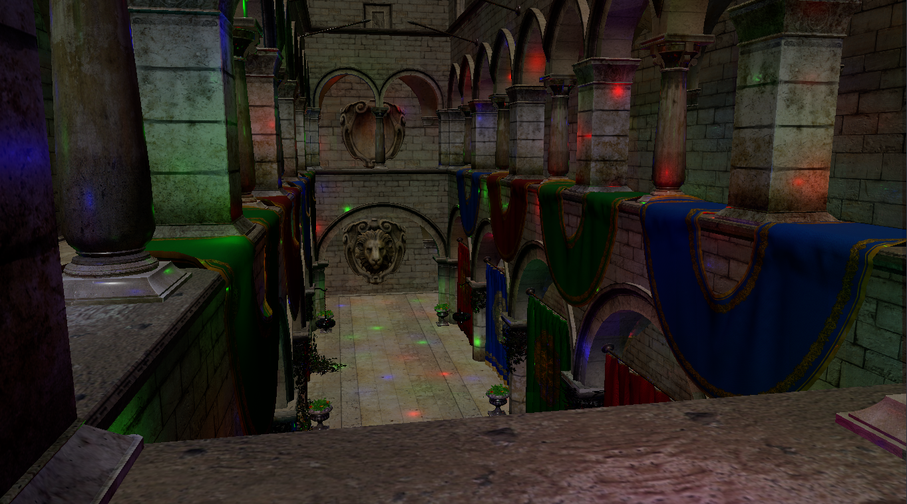

# efvk
This is a Vulkan version of my OpenGL engine,
[efgl](https://github.com/e-hat/efgl). 

## Current Progress

<i>Sponza with directional lighting and 2048 lights. The directional light kind
of drowns everything out - this would look super cool with shadows.</i>

With this clustered approach, I can get ~30fps with my Intel Xe chip with 2000+
lights in view, and 60fps when I'm not looking at the entire scene. Not bad! 
On my GTX 980 I am getting 60fps at all times. We are definitely GPU bound (this 
is obvious from the [tracy](https://github.com/wolfpld/tracy) profile).

 
 

At this many lights, almost a quarter of my GPU frame time is taken up by light
culling. At 4096, that proportion grows to half. If I really cared about getting insane numbers
of lights, I could probably accelerate culling with some kind of light BVH as
described in the [OG clustered rendering
paper](https://diglib.eg.org/handle/10.2312/EGGH.HPG12.087-096), but I don't really want to. I
think I want scenes with at most a couple hundred lights and it seems like this
will work great in its current state.

The other way to speed things up would be to 
1. Have less draw calls or 
2. Have less data to draw in my draw calls 

To do either of these, I'll need to get my entire scene onto my GPU. From here,
I can at least do a single draw call from the CPU. Next, I would implement
frustrum culling and change that CPU draw call into an indirect one. Next would
be occlusion culling, which I have a feeling would be the most helpful. With my
naive forward rendering, I'm sure there's tons of overdraw happening.

I think my next goal is shadow mapping my directional light, then skyboxes, then
IBL. 

After all that, I'll see what I can do to make this a truly GPU-driven renderer.

 

<i>Added mipmap generation and anisotropic filtering!!</i>

 
 

<i>Sponza again, this time with Cook-Torrance specular BRDF in
the fragment shader. Used reinhard tonemapping and gamma correction as
well.</i>

 
 

<i>Model loading with texures. Needs some mip-mapping though,
check out the Moire patterns!</i>

 
 

<i>Model loading and depth testing</i>

 
 

<i>Is that what I think it is?? A triangle!</i>

 
 

~Relatively close to drawing a triangle!!~

~Still not even close to drawing a triangle!!~
