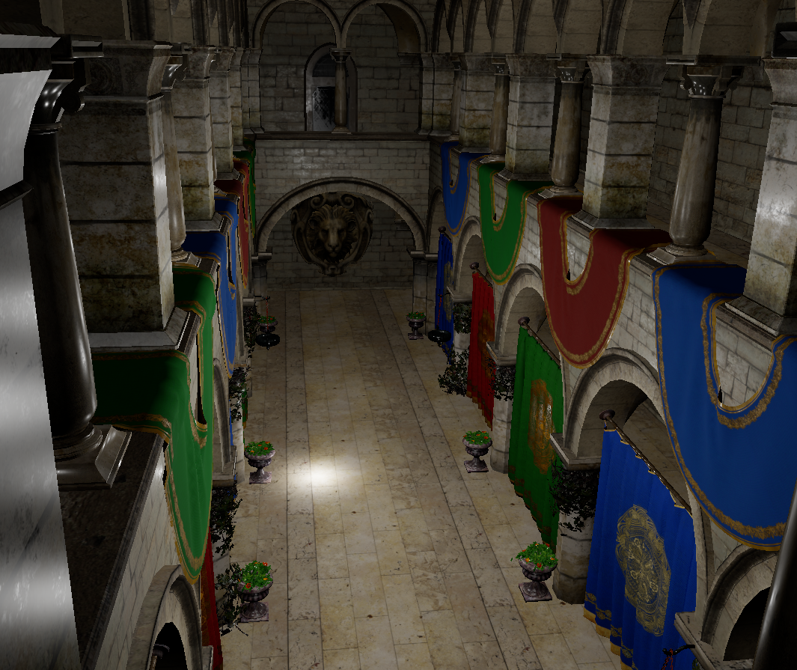
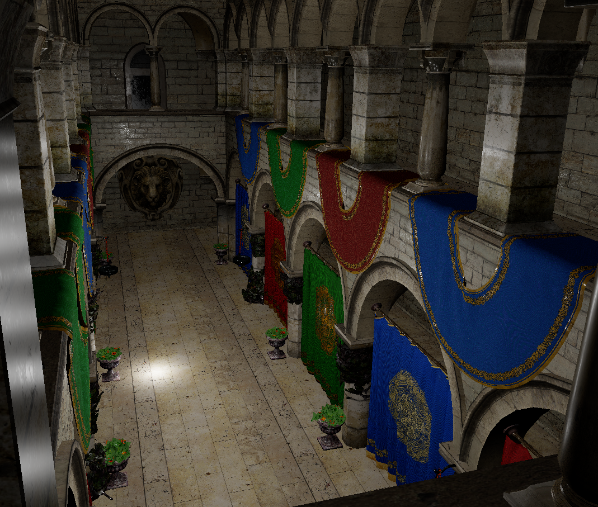
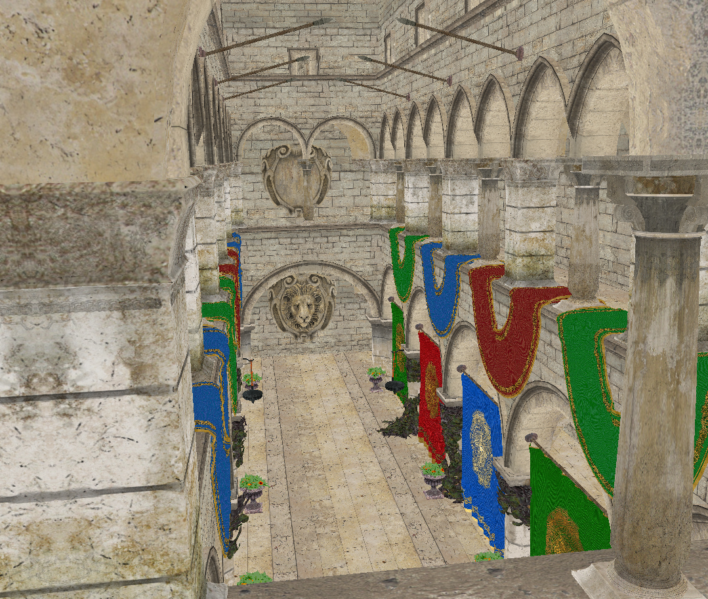
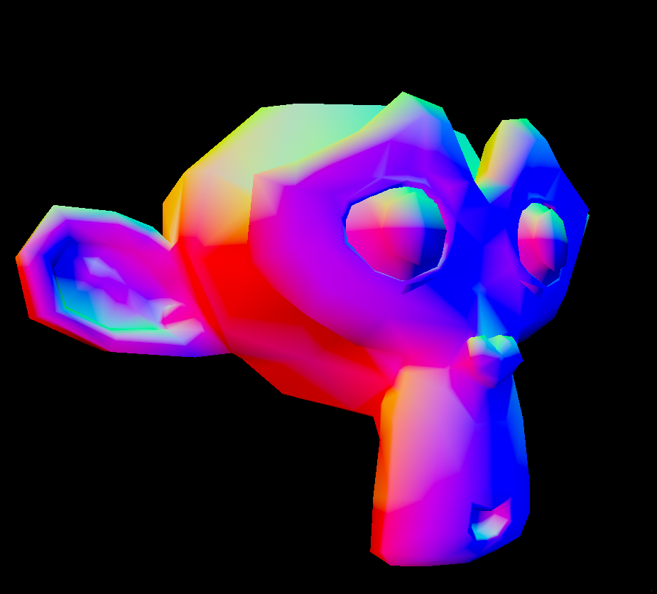
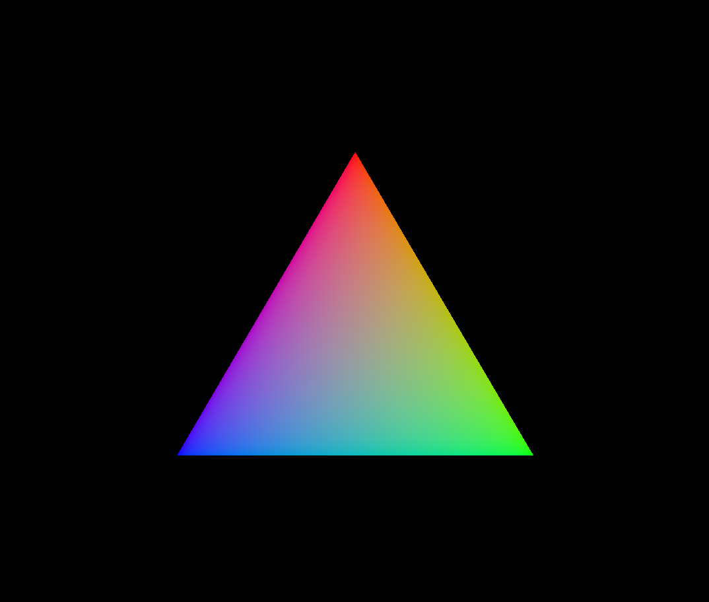

# efvk
This is a Vulkan version of my OpenGL engine,
[efgl](https://github.com/e-hat/efgl). 

## Current Progress

<i>Sponza again, this time with Cook-Torrance specular BRDF in
the fragment shader. Used reinhard tonemapping and gamma correction as
well.</i>

 
 

<i>Sponza again, this time with Cook-Torrance specular BRDF in
the fragment shader. Used reinhard tonemapping and gamma correction as
well.</i>

 
 

<i>Model loading with texures. Needs some mip-mapping though,
check out the Moire patterns!</i>

 
 

<i>Model loading and depth testing</i>

 
 

<i>Is that what I think it is?? A triangle!</i>

 
 

~Relatively close to drawing a triangle!!~

~Still not even close to drawing a triangle!!~
